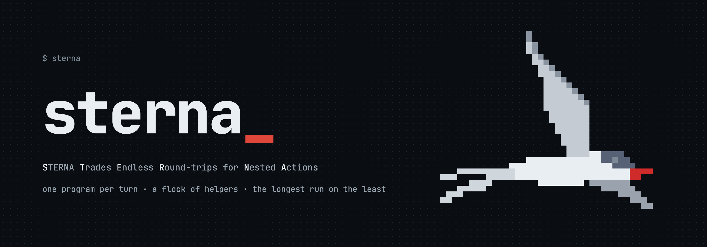

<p align="center">
  
</p>

# Sterna

**STERNA Trades Endless Round-trips for Nested Actions.**
*one program per turn · a study in agentic coding*

Sterna is a coding agent for your terminal. You give it a task in a project;
it works the task in turns, the way Claude Code or Codex does. It is named
for *Sterna paradisaea*, the Arctic tern, which makes the longest migration
of any animal.

Sterna is a public pre-release for macOS, Linux and Windows.

## A study

Sterna is one developer's study of agentic coding. I tried to design
something different: the model writes one program per turn instead of
calling one tool at a time. Measured against Codex on the same model
(GPT-6.1 Sol, 30 real bug reports), it fixes as many bugs with nearly a
fifth fewer requests to the model, at the same cost. Every measurement, the
good and the bad, is in [measurements](docs/measurements.md).

## What it is

**One program per turn instead of a round trip per tool.** Each turn the
model writes one TypeScript program, a *cell*, that runs in a V8 isolate
embedded in Sterna. `read`, `grep`, `edit`, `bash` and the rest are
functions inside it, so one turn can read several files, search, edit, run
the tests and branch on the result. What a tool returns stays in the
isolate as a named handle; the model sees a bounded preview and works on
the handle in the next cell, so a search that turns up 275 KB shows the
model about 210 tokens of it.

**Reads what the work needs.** Ask for a piece of code and the model gets
it whole, with the places that use it and the code related to it, and not
the code that only happens to sit nearby. What it shows was tuned on real
tasks, by what the model went on to use.

**A slow command never holds the session.** A command still running after
30 seconds carries on in the background; the model waits for it, stops it,
or works on and hears when it is done. Nothing is killed.

**Beside the turn.** **Subagents** take a whole separable goal and run
beside the task. Long output is folded by rules before the model reads it —
passing tests, build chatter and repeated lines go, every failure stays —
and the whole output is still there. **Jev**, a classifier you switch on by
naming its model, answers typed questions — is this request read-only, is
this a log — in about two seconds, and a task that stops producing anything
ends on its own.

**Long sessions.** Sterna never rewrites what it has already sent. When a
conversation outgrows the model's window it is compacted, and the results
of earlier turns stay usable.

**Your subscription or your key.** Sterna talks to models through the
**inference gateway**, a separate program it starts beside itself. The
gateway holds your API keys and subscription logins — they never enter the
conversation, the transcript or a log — pools several accounts of one kind,
and translates between the Anthropic, OpenAI and Gemini wire formats.

It also has what you would expect: a wide OS sandbox (Seatbelt on macOS,
Landlock and seccomp on Linux, an AppContainer on Windows) with package
registries reachable through an allowed-hosts proxy, one setting for how
much runs without asking (Ask, Sandboxed or Full access), `/plan` for a
read-only planning request, background jobs, web fetch (asking before a
host it has not reached before) and web search with a provider you choose,
MCP servers, image input,
rollback of the agent's changes, and resume.

## Install and update

```sh
curl -fsSL https://harzerheribert.github.io/sterna/install.sh | sh
```

The installer picks this machine's archive from the newest release
(`sterna-<version>-<target>.tar.gz`), verifies it against the release's
`SHA256SUMS`, unpacks it into a fresh `~/.local/lib/sterna/versions/<tag>`,
points `~/.local/lib/sterna/current` at it, and links `sterna` and
`inference-gateway` into `~/.local/bin`. It also adopts the subscription
broker (CLIProxyAPI) the release pins, after checking its SHA-256. It
installs nothing else, touches no credential and edits no shell profile.

On Windows, in PowerShell:

```powershell
irm https://harzerheribert.github.io/sterna/install.ps1 | iex
```

It does the same with the release's `.zip`: verified against `SHA256SUMS`,
unpacked into `%LOCALAPPDATA%\Programs\sterna\versions\<tag>`, with a
`current` junction pointing at it and `…\sterna\current\bin` added to your
user PATH (no administrator rights). Set `STERNA_VERSION` first to install a
particular release.

Builds: macOS on Apple silicon, Linux on x86_64 and arm64, and Windows on
x64 and arm64, all on the
[releases page](https://github.com/HarzerHeribert/sterna/releases).

**Updates.** A release install checks for a newer release when a session
starts (not more than once in five minutes) and installs it beside the
running one; the next start uses it. `sterna update` does it on demand and
`sterna update --check` only asks. `STERNA_DISABLE_AUTOUPDATE=1` turns the
check at start off. A build from source never updates itself.

**The desktop app.** One window for every session Sterna is running, in
every folder: start one in any folder, follow each step as it runs, and
answer what it asks. A session started in the terminal shows up there too,
live. Install it with the terminal's `sterna`, from the same release:

```sh
curl -fsSL https://harzerheribert.github.io/sterna/install.sh | sh -s -- --desktop
```

```powershell
$env:STERNA_DESKTOP = '1'; irm https://harzerheribert.github.io/sterna/install.ps1 | iex
```

On macOS it goes to `~/Applications/Sterna.app`, on Linux into your
applications menu, and on Windows into the Start menu. From then on it is
updated with `sterna`, into the new version's folder, so an app that is open
keeps running. The release also carries a `.dmg`, an `.AppImage`, a `.deb`
and a Windows setup for downloading by hand. They are not signed yet, so
macOS and Windows ask before they open one the first time; the install line
above does not need that.

**Coming from Pane?** Run the installer once: it installs `sterna`, removes
the old `pane` link, and removes `~/.local/lib/glasshouse` once nothing links
into it. On its first start Sterna moves your settings and sessions from
`~/.config/pane` and each project's `.pane` to the new names and says so.
Pane's own updater cannot reach Sterna.

## Start

```sh
cd your-project
sterna
```

The first time, Sterna says no credential is stored yet: type `/login` to
connect a subscription in the browser, or to store an API key or add your
own endpoint. `/models` chooses the model and its effort.

```sh
sterna -p "fix the failing test in crates/foo"   # one task, then exit
sterna exec "…" --output-format json            # the same, for scripts
sterna --resume                                  # pick an earlier session
sterna doctor                                    # what Sterna found and what is missing
```

Sterna reads what your project already has: `AGENTS.md` and `CLAUDE.md` at
the root and in subdirectories, your own `~/.config/sterna/AGENTS.md`, commands and skills in
`.claude/`, and the MCP servers `.mcp.json` names. Its own settings live in
`~/.config/sterna/config.toml` and `.sterna/config.toml`;
`sterna config import claude` brings over the permissions in
`.claude/settings.json`. More: [usage](docs/usage.md),
[configuration](docs/configuration.md).

## Accounts and models

Keys and logins belong to the gateway, not to a project. Inside Sterna:
`/login` (a subscription, an API key or a custom endpoint), `/key <provider>`,
`/models`, `/usage`. From the shell:

```sh
inference-gateway subscriptions usage        # each subscription's limits used, and when they reset
inference-gateway credentials set openai     # store a key, read from stdin
inference-gateway subscriptions --help       # connect, logout, pool, verify
```

Signing a subscription in to a third-party tool is against some providers'
terms; Sterna shows each warning before it signs in
([subscriptions](docs/subscriptions.md)). The gateway picks the provider and
account for a request; it never changes the model or effort you chose
([gateway](docs/gateway.md)).

## Themes

`/theme` shows every palette, grouped in families:

- **Classic** — a palette alone: neon, amber, ice, mono, violet, cobalt,
  mint, rose.
- **Parrots** — eight parrots whose plumage is the palette, perched on the
  session card: Blue-fronted Amazon, Sun Conure, Hyacinth Macaw, Scarlet
  Macaw, Blue-and-gold Macaw, Green-winged Macaw, Military Macaw,
  Sulphur-crested Cockatoo.

The birds need a terminal that shows true colour.

## Build from source

```sh
cargo build --release -p sterna -p inference-gateway
scripts/install-local.sh               # build, install into a new version directory, make it current
scripts/install-local.sh --rollback    # point `current` at the previous version
```

Each binary is self-contained: no daemon, Node or Python. Sterna embeds V8,
so its first build takes a while. The toolchain is pinned in
`rust-toolchain.toml`. How the two programs fit together:
[architecture](docs/architecture.md); every document:
[docs](docs/README.md).

## Contributing

Bug reports, ideas and pull requests are welcome; [CONTRIBUTING.md](CONTRIBUTING.md)
says how. This repository is not open source, so a pull request carries a
grant: you confirm you wrote it (or may submit it) and give HarzerHeribert a
perpetual, worldwide, royalty-free, irrevocable licence to use, modify,
distribute and relicense it as part of this project. You keep the copyright
in your own work. Report a security problem privately
([SECURITY.md](SECURITY.md)).

## Licence

Copyright (c) 2026 HarzerHeribert. **All rights reserved** — see
[LICENSE](LICENSE).

The source is public so it can be read, reviewed and referenced. That is not
a licence: no right to use, copy, modify or distribute it is granted, and
the crates are marked `publish = false`. Ask if you want one.

## Art

The birds are pixel art traced from photographs on Wikimedia Commons. Each
sprite was traced from the first photograph listed for it; the others were
used for colour and detail. The photographs belong to their authors under
the licences named.

| bird | photograph | author | licence |
|---|---|---|---|
| Arctic tern, in flight (logo) | [Arctic tern (Sterna paradisaea) in flight Myrar](https://commons.wikimedia.org/wiki/File:Arctic_tern_(Sterna_paradisaea)_in_flight_Myrar.jpg) | Charles J. Sharp | CC BY-SA 4.0 |
| | [Arctic tern (Sterna paradisaea) with eel Blonduos](https://commons.wikimedia.org/wiki/File:Arctic_tern_(Sterna_paradisaea)_with_eel_Blonduos.jpg) | Charles J. Sharp | CC BY-SA 4.0 |
| | [Eidersperrw sterna paradisaea with fish oben](https://commons.wikimedia.org/wiki/File:Eidersperrw_sterna_paradisaea_with_fish_oben.jpg) | Dirk Ingo Franke | CC BY-SA 2.0 DE |
| Arctic tern, perched | [Arctic Tern (Sterna paradisaea)](https://commons.wikimedia.org/wiki/File:Arctic_Tern_(Sterna_paradisaea).jpg) | Billy Lindblom | CC BY 2.0 |
| | [Arctic tern close-up (51101372759)](https://commons.wikimedia.org/wiki/File:Arctic_tern_close-up_(51101372759).jpg) | USFWS Alaska | public domain |
| | [Arctic Tern (Sterna paradisaea), Norwick](https://commons.wikimedia.org/wiki/File:Arctic_Tern_(Sterna_paradisaea),_Norwick_-_geograph.org.uk_-_5862264.jpg) | Mike Pennington | CC BY-SA 2.0 |
| | [Arctic Tern on Beach](https://commons.wikimedia.org/wiki/File:Arctic_Tern_on_Beach.jpg) | Lucas Golden | CC BY 4.0 |
| Blue-fronted Amazon | [Turquoise-fronted amazon (Amazona aestiva) older adult](https://commons.wikimedia.org/wiki/File:Turquoise-fronted_amazon_(Amazona_aestiva)_older_adult.JPG) | Charles J. Sharp | CC BY-SA 4.0 |
| | [Turquoise-fronted amazon (Amazona aestiva) Rio Negro](https://commons.wikimedia.org/wiki/File:Turquoise-fronted_amazon_(Amazona_aestiva)_Rio_Negro.jpg) | Charles J. Sharp | CC BY-SA 4.0 |
| | [Amazona aestiva -upper body-8a](https://commons.wikimedia.org/wiki/File:Amazona_aestiva_-upper_body-8a.jpg) | Gilberto Santa Rosa | CC BY 2.0 |
| Sun conure | [Aratinga-solstitialis](https://commons.wikimedia.org/wiki/File:Aratinga-solstitialis.jpg) | Penkinvaltaaja | CC BY-SA 4.0 |
| | [Aratinga solstitialis - Loro Parque 01](https://commons.wikimedia.org/wiki/File:Aratinga_solstitialis_-_Loro_Parque_01.jpg) | H. Zell | CC BY-SA 3.0 |
| | [Aratinga solstitialis on perch](https://commons.wikimedia.org/wiki/File:Aratinga_solstitialis_on_perch.jpg) | Sarah G | CC BY-SA 2.0 |
| Hyacinth macaw | [Anodorhynchus hyacinthinus -Mato Grosso -Brazil-8b](https://commons.wikimedia.org/wiki/File:Anodorhynchus_hyacinthinus_-Mato_Grosso_-Brazil-8b.jpg) | Nori Almeida | CC BY 2.0 |
| | [Hyacinth Macaw (Anodorhynchus hyacinthinus) (31676594802)](https://commons.wikimedia.org/wiki/File:Hyacinth_Macaw_(Anodorhynchus_hyacinthinus)_(31676594802).jpg) | Bernard Dupont | CC BY-SA 2.0 |
| | [Arara Azul no Pantanal](https://commons.wikimedia.org/wiki/File:Arara_Azul_no_Pantanal.jpg) | Leonardo Ramos | CC BY-SA 4.0 |
| | [Anodorhynchus hyacinthinus -Brazilian Pantanal-8](https://commons.wikimedia.org/wiki/File:Anodorhynchus_hyacinthinus_-Brazilian_Pantanal-8.jpg) | Alexander Yates | CC BY 2.0 |
| Scarlet macaw | [Scarlet macaw](https://commons.wikimedia.org/wiki/File:Scarlet_macaw.jpg) | Rivadavia.vila | CC0 |
| | [Ara macao -Vogelpark Walsrode -perch-8a](https://commons.wikimedia.org/wiki/File:Ara_macao_-Vogelpark_Walsrode_-perch-8a.jpg) | Tobias | CC BY-SA 2.0 |
| | [Scarlet Macaw Phoenix Zoo Mar23 A7R 04528](https://commons.wikimedia.org/wiki/File:Scarlet_Macaw_Phoenix_Zoo_Mar23_A7R_04528.jpg) | Timothy A. Gonsalves | CC BY-SA 4.0 |
| Blue-and-gold macaw | [Ara ararauna -parrot perching on table -Fort Myers Beach-8a](https://commons.wikimedia.org/wiki/File:Ara_ararauna_-parrot_perching_on_table_-Fort_Myers_Beach-8a.jpg) | Amber Rae Lambke | CC BY 2.0 |
| | [Ara ararauna - Vogelburg Weilrod 02](https://commons.wikimedia.org/wiki/File:Ara_ararauna_-_Vogelburg_Weilrod_02.jpg) | H. Zell | CC BY-SA 3.0 |
| | [Ara ararauna -Brazil -perching on branch-6a](https://commons.wikimedia.org/wiki/File:Ara_ararauna_-Brazil_-perching_on_branch-6a.jpg) | Tiago Zaniratti | CC BY 2.0 |
| | Ara ararauna (Linnaeus 1758) | Michael Gäbler | CC BY 3.0 |
| | Ara ararauna 3 | Eliaxt | CC BY-SA 4.0 |
| Green-winged macaw | [Green-winged Macaw (Ara chloroptera) -Maine -zoo](https://commons.wikimedia.org/wiki/File:Green-winged_Macaw_(Ara_chloroptera)_-Maine_-zoo.jpg) | Peter Dutton | CC BY 2.0 |
| | [Green-winged macaw at Cougar Mountain Zoological Park](https://commons.wikimedia.org/wiki/File:Green-winged_macaw_at_Cougar_Mountain_Zoological_Park.jpg) | Dcoetzee | CC0 |
| Military macaw | [Macaw Mtn bird rehabilitation centre-Military Macaw (6849859148)](https://commons.wikimedia.org/wiki/File:Macaw_Mtn_bird_rehabilitation_centre-Military_Macaw_(6849859148).jpg) | Murray Foubister | CC BY-SA 2.0 |
| | [Military macaw at Cougar Mountain Zoological Park](https://commons.wikimedia.org/wiki/File:Military_macaw_at_Cougar_Mountain_Zoological_Park.jpg) | Dcoetzee | CC0 |
| | [Military Macaw (Ara militaris) RWD1](https://commons.wikimedia.org/wiki/File:Military_Macaw_(Ara_militaris)_RWD1.jpg) | Dick Daniels | CC BY-SA 3.0 |
| | [Ara militaris -London Zoo-8a](https://commons.wikimedia.org/wiki/File:Ara_militaris_-London_Zoo-8a.jpg) | neiljs | CC BY 2.0 |
| Sulphur-crested cockatoo | [Cacatua galerita -Hayman Island -perching on balcony-8](https://commons.wikimedia.org/wiki/File:Cacatua_galerita_-Hayman_Island_-perching_on_balcony-8.jpg) | Sarah Ackerman | CC BY 2.0 |
| | [Cacatua galerita - Vogelburg Weilrod 02](https://commons.wikimedia.org/wiki/File:Cacatua_galerita_-_Vogelburg_Weilrod_02.jpg) | H. Zell | CC BY-SA 3.0 |
| | [Cacatua galerita - Vogelburg Weilrod 03](https://commons.wikimedia.org/wiki/File:Cacatua_galerita_-_Vogelburg_Weilrod_03.jpg) | H. Zell | CC BY-SA 3.0 |
| | [Sulphur Crested Cockatoo](https://commons.wikimedia.org/wiki/File:Sulphur_Crested_Cockatoo.jpg) | Ffyfejam | CC BY-SA 4.0 |
